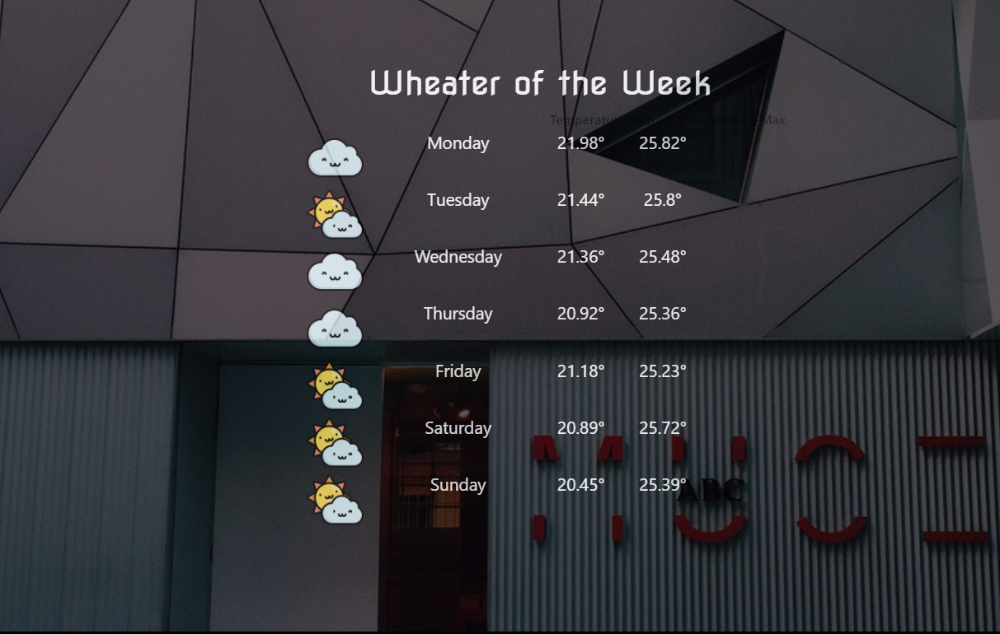

# WEATHER

* **Unidad:** _JUGANDO CON WEB APIS_
* **Ejercicio:** _WEATHER_
* **Desarrolladora:** _Dayam llerena y Margarita Sutta._

***

¿Has visto que los sistemas operativos móviles vienen con una APP de predicción del clima? ¡Vamos a hacer la nuestra! Para ello, usaremos la API de Dark Sky y esperemos llegues a usar un API de imágenes como Flickr, Unsplash u otro.

   


  

  

***

## Desarrollo de la aplicación

1. Creación de la clave del Dark Sky API :

> [Obtener una clave o autenticación](https://darksky.net/dev)

```javascript
  https://api.darksky.net/forecast/[key]/[latitude],[longitude]

```

```javascript
  // url API key
  const apiLinkDS = `https://api.darksky.net/forecast/bfd18dc740bc1c995da4964a8547b03f/${myPosition.lat},${myPosition.lng}?units=si`;
```

***

## Herramientas a utilizar

1. HTML 5
2. CSS3
3. Bootstrap
4. Javascript
5. jQuery
6. Dark Sky API
7. API de Geolocation

***
